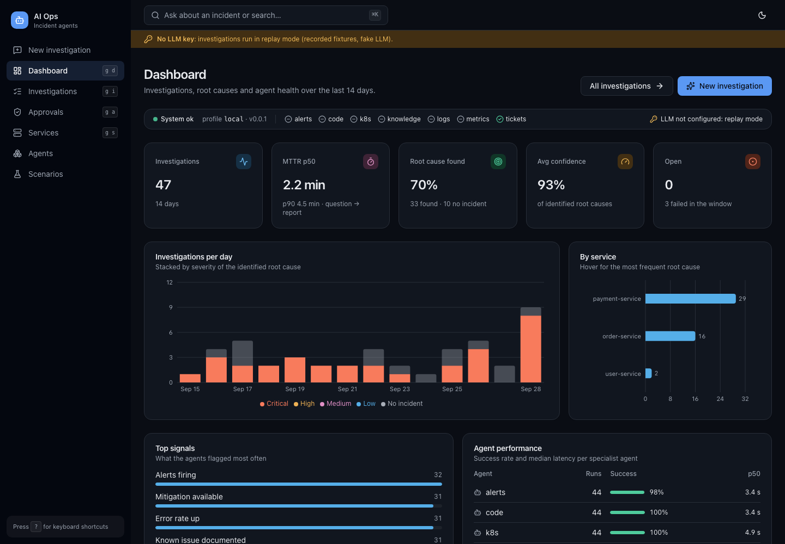

# AI Incident Agents

[](https://github.com/vigneshAJ1503/AI_Incident_Agents/actions/workflows/ci.yml)

AI Incident Agents is an incident investigation and troubleshooting platform built from multiple AI agents. You describe an incident in plain language, e.g. *"Payment API is returning HTTP 500 in production"*. An orchestrator then sends specialized agents out to your tools through **MCP**:
- logs
- Kubernetes
- metrics
- alerts
- code changes
- tickets
- runbooks

Finally, an RCA agent returns an **evidence-backed** root-cause hypothesis with next steps.

- 📘 **Master development plan:** [MASTER_PLAN.md](MASTER_PLAN.md)
- 🏗️ **Architecture:** [HLD](docs/architecture/HLD.png) · [Local deployment](docs/architecture/local-deployment.png)
- 🧭 **Decisions:** [docs/adr](docs/adr)
- 💸 **Runs for $0:** [docs/setup/zero-cost.md](docs/setup/zero-cost.md)
- 📈 **AI observability + cost:** [docs/observability.md](docs/observability.md) (cost per investigation/agent, `/metrics`, Grafana, opt-in traces, budgets)
- 🏢 **New company = config only:** [docs/portability.md](docs/portability.md) (`profiles/<company>/`, `AIOPS_PROFILE`, `aiops profile init`)

## Quick start

**See the product in one command** (Docker only, zero cost, ~0.3 GB of memory):

```bash
make demo        # Web UI + API + Postgres with a 14-day history → http://localhost:3100
make demo-down   # stop it (data kept)
```



Ask "Payment API is returning HTTP 500 in production", watch the agents stream in, read the
root cause and approve a Jira draft. Without an LLM key every investigation is a replay of
recorded fixtures (zero tokens). `make demo-live` adds Minikube and fault injection; see
[docs/setup/demo.md](docs/setup/demo.md).

For development:

```bash
make preflight   # check prerequisites (MASTER_PLAN.md §8)
make setup       # install dependencies + git hooks
make check       # lint + typecheck + unit tests
cd backend && uv run aiops --help
```

## Status

| Milestone | Scope | State |
|-----------|-------|-------|
| PR-001 | Repository bootstrap & CI | ✅ |
| v0.1.0 | Log (ELK) agent with evals ([replay scorecard](evals/reports/2026-09-25-logs-replay.md): 6/6, 0 false positives) | ⏳ |
| v0.2.0 | Jira agent + approvals | ⏳ |
| v0.3.0 | Minikube runtime + fault injection | ⏳ |
| v0.4.0 | All specialist agents | ⏳ |
| v0.5.0 | End-to-end RCA (CLI) | ⏳ |
| v0.6.0 | Web UI + `make demo` ([demo guide](docs/setup/demo.md)) | ✅ PR-039 (tag pending) |
| v1.0.0 | Evaluated, observable, hardened | ⏳ |

## Repository layout
See [MASTER_PLAN.md §7](MASTER_PLAN.md#7-repository--folder-structure). Directories are added by the PR that first needs them.

## License
[MIT](LICENSE)
